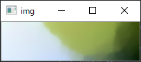

# cuda_blsom

# 1 概要
[一括学習型自己組織化マップ(BMSOM)](http://bioinfo.ie.niigata-u.ac.jp/?SOM%E3%81%A8%E3%81%AF#oed7b8fd)の学習を、GPUを用いて高速に行います。 
Umatrixの書き出しも行えます。

# 2 動作確認環境
 - windows(7/8/10)
 - cuda 8.0
 - cudnn 6.0
# 3 ディレクトリ構成
└─BLSOM 
　　└─sample 
　　　　├─result 
　　　　└─train 

## train 
  学習サンプルのデータが格納されています 
  サンプルでは、[blsom_to_img](https://github.com/toefuVox/blsom_to_img)でベクトルデータに変換した画像から、[pca_for_blsom](https://github.com/toefuVox/pca_for_blsom)を用いて、trainデータを作成しています。
  任意のデータで学習する場合は、[pca_for_blsom](https://github.com/toefuVox/pca_for_blsom)を用いて、学習データを作成して下さい。 
 学習サンプルでは、以下の4ファイルが保存されています。

- [convImg2Txt.txt](BLSOM/sample/train/convImg2Txt.txt) ......　学習対象となる入力ベクトル。
- [average_vector.txt](BOSOM/sample/../../BLSOM/sample/train/average_vector.txt)　.......　入力平均ベクトルが保存されたファイル。
- [rotation.txt](BOSOM/sample/../../BLSOM/sample/train/rotation.txt) 　　.......　第1主成分、第2主成分の固有ベクトル
- [sdev.txt](BOSOM/sample/../../BLSOM/sample/train/sdev.txt)　　 　 .......　第1主成分、第2主成分の標準偏

## result 
  学習サンプルの学習結果が格納されています。

# 4 利用方法
## 1 入力ベクトルの準備
入力ベクトルの準備をしてください。
形式は、[convImg2Txt.txt](BLSOM/sample/train/convImg2Txt.txt)を参考にしてください。行がサンプル数、列が入力ベクトルの次元です。
サンプルでは、[blsom_to_img](https://github.com/toefuVox/blsom_to_img)の[sample/sample001.png](https://github.com/toefuVox/blsom_to_img/blob/master/sample/convImg2Text/sample001.png)をテキストに変換したデータ[convImg2Txt.txt](https://github.com/toefuVox/blsom_to_img/blob/master/sample/convImg2Text/convImg2Txt.txt)を利用しています。

20x30で小さいですが、この画像を学習します。 
わかりにくいですが、草原と森と青空が映っている画像です。

## 2 主成分分析
[BL-SOM](http://bioinfo.ie.niigata-u.ac.jp/?SOM%E3%81%A8%E3%81%AF)はアルゴリズムの性質上、主成分分析を必要とします。 

学習対象のデータに対して主成分分析を行い、平均ベクトル、第1主成分の固有ベクトルと第2主成分の固有ベクトル、第1主成分の標準偏差と第2主成分の昇順偏差を求める必要があります。 
その際に[pca_for_blsom](https://github.com/toefuVox/pca_for_blsom)を用いると、学習の準備が楽です。

## 3 blsomの実行
77～80行目で、学習データを準備しています。

~~~
	train = LoadTrains("sample\\train\\convImg2Txt.txt",' ');
	ave_vec = LoadAverageVector("sample\\train\\average_vector.txt");
	rotation = LoadRotation("sample\\train\\rotation.txt");
	sdev = LoadStandardDev("sample\\train\\sdev.txt");;
~~~

87～90行目で、BLSOMの初期化を行っています。
~~~
    BLSOM blsom = BLSOM(vec_dim, map_width);
	blsom.Init(sdev[0], sdev[1], rotation[0].data(), rotation[1].data(), ave_vec.data());
	blsom.SetTrainingData(train);
	blsom.InitMapWeight(INIT_BATCH);
~~~

102行目で、学習回数を指定して学習を行っています。
~~~
	blsom.Learning(50);
~~~

104～110行目で、学習結果の出力を行っています。 
8近傍のUmatrixの書き出しも同時に行えます。
~~~
    /* Get Learned Map */
	som = blsom.GetSOMMap();
	WriteSOMMAP("sample\\result\\result_batch_map.txt", som, vec_dim, map_width, blsom.MapHeight());

	/* Get Umatrix */
	umatrix = blsom.GetUMatrix();
	WriteUmatrix("sample\\result\\result_umatrix.txt", umatrix
~~~

## 4 学習結果の可視化
出力した[result_batch_map.txt](BLSOM/sample/result/result_batch_map.txt)の可視化を行います。 
※注意 : 今回は、RGB形式の画像を3次元の入力ベクトルと見なしているので可視化が可能です。
今回、可視化には[blsom_to_img](https://github.com/toefuVox/blsom_to_img)の、blsom2Img関数を利用します。
 上記の関数を用いて、可視化した結果は以下の通りです。

しっかりと色で分類されていることが確認できます。
